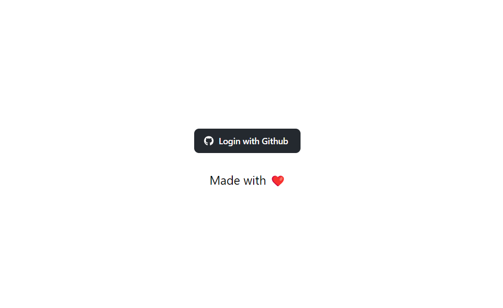
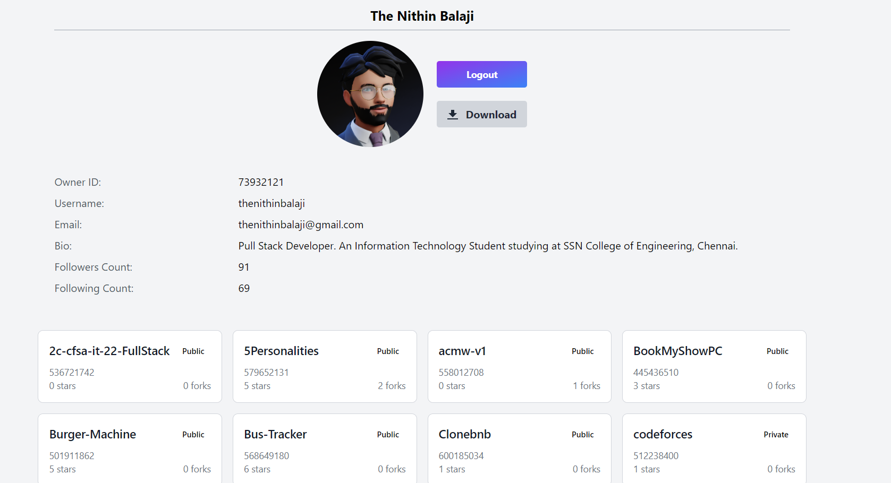
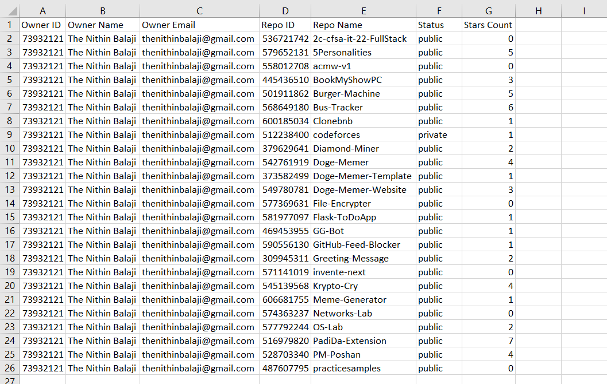

# Getting Started with GitHub Repo Fetcher

This application was made using **HTML, Tailwind CSS, Flask, GitHub API and Postgres DB.** You can run this application locally if you have **postgres** installed on your PC. Additionally you need to create a **GitHub OAuth App** to generate the **CLIENT ID** and **CLIENT SECRET** for the application to function. [Read on How to Create a GitHub OAuth App](https://docs.github.com/en/apps/oauth-apps/building-oauth-apps/creating-an-oauth-app).  

<p align="center">
<a href="#">
    
</a>
</p>

**NOTE: The environment variables weren't committed to the repo due to security reasons. The format of env file has been given below.**



## Running the Server

In the project directory, you can run:

```bash
python main.py
```

Open <http://localhost:5000> to view it in your browser.

## Missing Modules

Recommended to create virtual environment and install modules from requirements.txt using:

```bash
python -m virtualenv venv
venv/scripts/activate
pip install -r requirements.txt
```



## Environment Variables

The env file contains the following data

```env
CLIENT_ID = ""
CLIENT_SECRET = ""
SECRET_KEY = ""
DB_PASS = ""
```

**CLIENT_ID** and **CLIENT_SECRET** can be retrieved from GitHub Outh Apps Page.
**DB_PASS** is the password of the Postgres Server.
**SECRET_KEY** is the secret key required by the Flask server to sign cookies. It can be anything of your choice.

### Export CSV File with Repo Data


